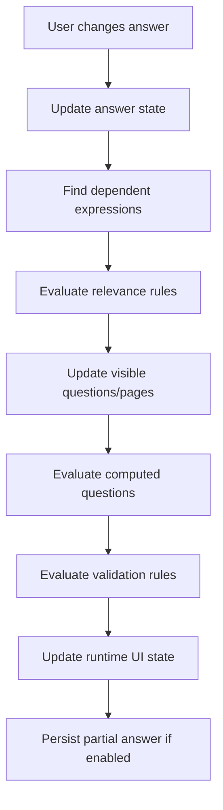
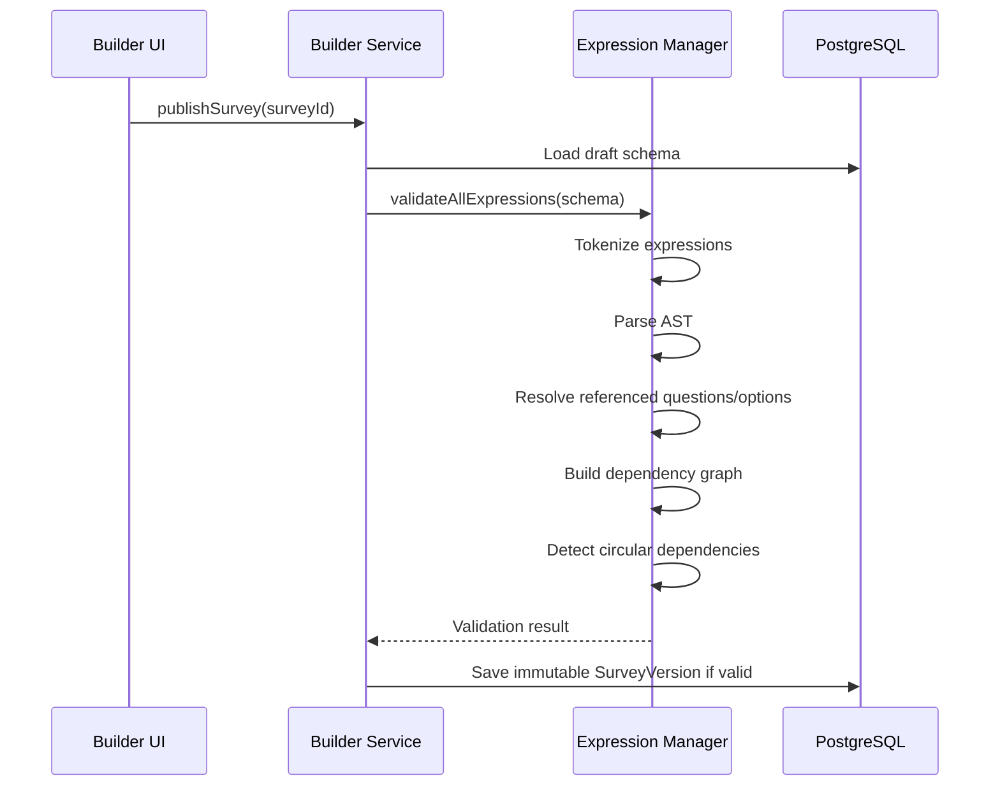

# 01 - Advanced Expression Manager Architecture

## 1. Purpose

The Expression Manager is the brain of a LimeSurvey-like survey runtime. It controls dynamic behavior such as question relevance, conditional display, validation rules, computed/equation questions, piping, default values, and branching.

In LimeSurvey, Expression Manager is one of the hardest parts to replace because many features depend on it. In this new platform, treat it as a dedicated domain engine, not as simple `if/else` logic inside React components.

## 2. Responsibilities

- Parse expressions written by survey authors.
- Validate expression syntax before survey publishing.
- Detect referenced questions, variables, attributes, tokens, and functions.
- Evaluate expressions during runtime when answers change.
- Support relevance equations for question/page visibility.
- Support validation equations for answer validation.
- Support equation/computed question types.
- Support text piping such as `Hello {TOKEN:FIRSTNAME}` or `You answered {Q1}`.
- Detect circular dependencies.
- Build a dependency graph so only affected expressions are recalculated.
- Run safely on both client and server where needed.

## 3. Main Concepts

| Concept | Description |
|---|---|
| Expression | A formula or conditional statement, e.g. `Q1 == "yes" && age >= 18`. |
| Tokenizer | Converts raw expression string into tokens. |
| Parser | Converts tokens into an AST. |
| AST | Abstract Syntax Tree used for validation and evaluation. |
| Evaluator | Executes AST against current answer/context values. |
| Variable Resolver | Resolves question codes, participant attributes, session variables, and system values. |
| Function Registry | Safe list of supported functions. |
| Dependency Graph | Tracks which expressions depend on which questions. |

## 4. Expression Types

| Type | Example | Usage |
|---|---|---|
| Relevance expression | `Q1 == "yes"` | Show/hide question or page. |
| Validation expression | `age >= 18` | Enforce answer rule. |
| Default expression | `today()` | Pre-fill answer. |
| Equation expression | `sum(Q1, Q2, Q3)` | Computed hidden/display question. |
| Piping expression | `Welcome {participant.name}` | Render dynamic text. |
| Quota expression | `gender == "male" && country == "MY"` | Count quota match. |
| Branch expression | `score > 80` | Jump to page or screen-out. |

## 5. Runtime Evaluation Flow



## 6. Publish-Time Validation Flow



## 7. Recommended Expression Syntax

Use a controlled JavaScript-like syntax, but never execute raw JavaScript with `eval`.

Examples:

```txt
Q1 == "yes"
Q1 in ["A", "B", "C"]
age >= 18 && country == "MY"
countSelected(Q5) >= 2
isEmpty(Q10) == false
sum(score_1, score_2, score_3) >= 50
today() <= survey.endDate
```

## 8. Supported Operators

| Operator | Meaning |
|---|---|
| `==` | Equal. |
| `!=` | Not equal. |
| `>` | Greater than. |
| `>=` | Greater than or equal. |
| `<` | Less than. |
| `<=` | Less than or equal. |
| `&&` | Logical AND. |
| `||` | Logical OR. |
| `!` | Logical NOT. |
| `in` | Value is inside list. |
| `contains` | Multi-answer contains value. |
| `matches` | Regex match, if enabled. |

## 9. Function Registry

Only allow safe registered functions.

| Function | Description |
|---|---|
| `isEmpty(value)` | Checks blank/null/empty array. |
| `isNotEmpty(value)` | Opposite of empty. |
| `countSelected(question)` | Count selected options. |
| `sum(...values)` | Numeric sum. |
| `avg(...values)` | Numeric average. |
| `min(...values)` | Minimum value. |
| `max(...values)` | Maximum value. |
| `round(value, decimals)` | Round number. |
| `today()` | Current date. |
| `now()` | Current timestamp. |
| `dateDiff(a,b,unit)` | Difference between dates. |
| `regex(value, pattern)` | Regex validation. |
| `coalesce(a,b)` | First non-empty value. |
| `if(condition,a,b)` | Conditional value. |

## 10. Data Model Additions

Add expression-related tables if normalized tracking is needed.

```prisma
model ExpressionRule {
  id              String   @id @default(uuid())
  surveyVersionId String
  scope           String   // survey, page, question, quota, template
  targetType      String   // question, page, text, quota
  targetId        String
  expressionType  String   // relevance, validation, equation, piping, branch
  expressionText  String
  astJson         Json     @default("{}")
  dependenciesJson Json    @default("[]")
  errorJson       Json     @default("{}")
  isValid         Boolean  @default(false)
  createdAt       DateTime @default(now())
  updatedAt       DateTime @updatedAt

  @@index([surveyVersionId, targetType, targetId])
  @@index([expressionType])
}
```

## 11. Expression AST Example

Expression:

```txt
age >= 18 && country == "MY"
```

AST:

```json
{
  "type": "LogicalExpression",
  "operator": "&&",
  "left": {
    "type": "BinaryExpression",
    "operator": ">=",
    "left": { "type": "Identifier", "name": "age" },
    "right": { "type": "Literal", "value": 18 }
  },
  "right": {
    "type": "BinaryExpression",
    "operator": "==",
    "left": { "type": "Identifier", "name": "country" },
    "right": { "type": "Literal", "value": "MY" }
  }
}
```

## 12. Dependency Graph Example

```json
{
  "Q1": ["rule_001", "rule_003"],
  "Q2": ["rule_002"],
  "score_total": ["rule_010"]
}
```

When `Q1` changes, only `rule_001` and `rule_003` must be recalculated.

## 13. Client vs Server Evaluation

| Location | Usage |
|---|---|
| Client-side | Instant UI show/hide, progressive validation, computed display. |
| Server-side | Final validation, security, submit-time correctness, export-time recalculation. |

Rule: client-side evaluation is for UX. Server-side evaluation is the source of truth.

## 14. Implementation Folder Structure

```txt
features/expression/
├── tokenizer.ts
├── parser.ts
├── ast.ts
├── evaluator.ts
├── dependency-graph.ts
├── variable-resolver.ts
├── function-registry.ts
├── validators.ts
├── piping.ts
├── errors.ts
└── tests/
```

## 15. Development Notes

Start with basic boolean expressions and gradually add functions. Do not try to match all LimeSurvey Expression Manager capabilities in the first sprint. The minimum production-ready version should support question references, boolean logic, comparison operators, visibility, validation, and computed values.
