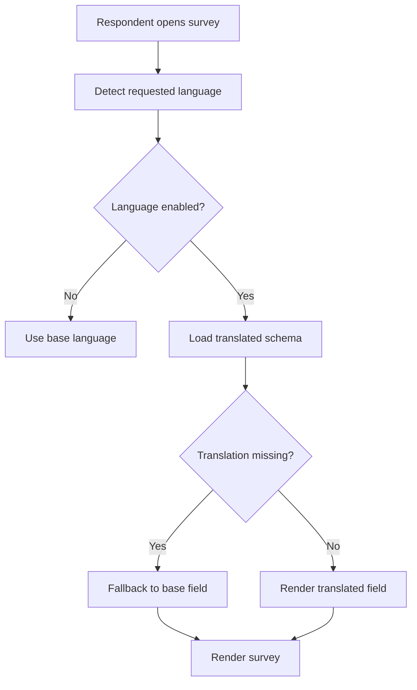

# 02 - Multilingual and Localization Architecture

## 1. Purpose

A LimeSurvey-like system must support multilingual surveys at the survey metadata, question, answer option, subquestion, email template, public runtime, admin UI, and export level.

This module separates system UI localization from survey content translation.

## 2. Language Layers

| Layer | Description |
|---|---|
| System UI Locale | Admin interface language, e.g. English/Malay. |
| Survey Base Language | Main authoring language for a survey. |
| Survey Additional Languages | Extra respondent-facing languages. |
| Runtime Locale | Language used when respondent opens survey. |
| Email Locale | Language used for invitation/reminder emails. |
| Export Locale | Language used for exported question labels and answers. |

## 3. Core Rules

- Every survey has one base language.
- Additional languages inherit structure from the base language.
- Question IDs and option IDs must remain language-neutral.
- Translations should not create separate question records unless needed for version snapshots.
- Missing translations should fall back to base language.
- Published versions should snapshot translations to preserve historical accuracy.

## 4. Data Model Additions

```prisma
model SurveyLanguage {
  id        String  @id @default(uuid())
  surveyId  String
  code      String  // en, ms, zh-CN, ko
  name      String
  isBase    Boolean @default(false)
  isEnabled Boolean @default(true)
  orderIndex Int    @default(0)

  @@unique([surveyId, code])
  @@index([surveyId, isEnabled])
}

model SurveyTranslation {
  id        String @id @default(uuid())
  surveyId  String
  language  String
  title     String?
  description String?
  welcomeText String?
  endText   String?
  policyText String?

  @@unique([surveyId, language])
}

model QuestionTranslation {
  id         String @id @default(uuid())
  questionId String
  language   String
  title      String?
  description String?
  helpText   String?
  placeholder String?

  @@unique([questionId, language])
}

model QuestionOptionTranslation {
  id         String @id @default(uuid())
  optionId   String
  language   String
  label      String?

  @@unique([optionId, language])
}

model EmailTemplateTranslation {
  id              String @id @default(uuid())
  emailTemplateId  String
  language        String
  subject         String
  bodyHtml        String
  bodyText        String?

  @@unique([emailTemplateId, language])
}
```

## 5. Translation Resolution Flow



## 6. Runtime Language Detection Priority

1. Explicit URL parameter: `/s/customer-feedback?lang=ms`.
2. Token/participant preferred language.
3. Respondent session selected language.
4. Browser `Accept-Language` header.
5. Survey base language.

## 7. Survey Schema Snapshot Example

```json
{
  "baseLanguage": "en",
  "availableLanguages": ["en", "ms", "zh-CN"],
  "translations": {
    "ms": {
      "survey": {
        "title": "Kajian Kepuasan Pelanggan"
      },
      "questions": {
        "q_001": {
          "title": "Adakah anda berpuas hati dengan servis kami?"
        }
      },
      "options": {
        "opt_yes": { "label": "Ya" },
        "opt_no": { "label": "Tidak" }
      }
    }
  }
}
```

## 8. Translation Builder UI

Recommended admin layout:

```txt
+-------------------------------------------------------------+
| Language switch: Base EN | Malay | Korean | Chinese          |
+--------------------+--------------------+-------------------+
| Base text          | Translation editor | Translation state |
| Question title     | Editable field     | Missing/Done      |
| Help text          | Editable field     | Missing/Done      |
| Options            | Editable labels    | Missing/Done      |
+--------------------+--------------------+-------------------+
```

## 9. Translation Status

| Status | Meaning |
|---|---|
| Missing | No translated value. |
| Draft | Translation exists but not reviewed. |
| Complete | Translation reviewed/approved. |
| Outdated | Base text changed after translation was created. |
| Machine Translated | Generated by AI or translation provider. |

## 10. API Examples

```txt
GET  /api/admin/surveys/[surveyId]/languages
POST /api/admin/surveys/[surveyId]/languages
GET  /api/admin/surveys/[surveyId]/translations/[language]
PUT  /api/admin/surveys/[surveyId]/translations/[language]
POST /api/admin/surveys/[surveyId]/translations/[language]/sync-from-base
POST /api/admin/surveys/[surveyId]/translations/[language]/machine-translate
```

## 11. Export Localization

Exports should support these modes:

| Mode | Description |
|---|---|
| Base language export | Always export question labels in base language. |
| Respondent language export | Export each response using respondent's runtime language. |
| Selected language export | Admin chooses one export language. |
| Code-only export | Export stable question codes and raw values only. |

## 12. Implementation Notes

- Store stable IDs and codes separately from labels.
- Never use translated text as a primary key.
- Keep translations in published snapshot to avoid old responses showing future edited translations.
- Add translation completeness validation before publish, but allow publish with fallback if organization setting permits.
