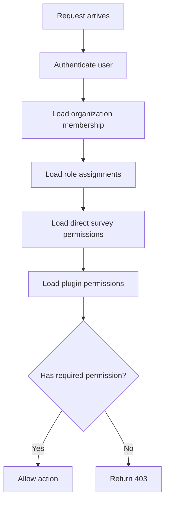

# 04 - Granular Permissions and RBAC Architecture

## 1. Purpose

The base document includes simple role-based permissions. For LimeSurvey-like parity, permissions must be more granular because survey administration involves many separate capabilities: create, edit, activate, browse responses, export, manage tokens, manage quotas, manage templates, and manage plugins.

## 2. Permission Model

Use a hybrid model:

- Organization-level roles for broad access.
- Survey-level permissions for individual survey access.
- System-level permissions for super admin features.
- Plugin-registered permissions for extension modules.

## 3. Permission Scope

| Scope | Example |
|---|---|
| System | Manage global settings, plugins, themes, health checks. |
| Organization | Manage users, API keys, organization branding. |
| Survey | Edit survey, activate survey, manage responses. |
| Participant | Import participants, send invitations. |
| Response | Browse, update, delete, export responses. |
| Plugin | Configure plugin, access plugin page. |

## 4. Permission Key List

| Permission Key | Description |
|---|---|
| `system.settings.manage` | Manage global settings. |
| `system.plugins.manage` | Install/enable/disable plugins. |
| `system.themes.manage` | Manage global themes. |
| `organization.users.manage` | Invite/remove organization users. |
| `organization.roles.manage` | Manage roles and permissions. |
| `organization.api_keys.manage` | Create/revoke API keys. |
| `survey.create` | Create survey. |
| `survey.read` | View survey metadata. |
| `survey.update` | Edit survey settings. |
| `survey.delete` | Delete/archive survey. |
| `survey.builder.manage` | Edit pages/questions/options. |
| `survey.logic.manage` | Manage relevance/validation/branching. |
| `survey.activate` | Publish/activate survey. |
| `survey.deactivate` | Pause/close survey. |
| `survey.copy` | Duplicate survey. |
| `survey.translate` | Manage translations. |
| `participants.manage` | Add/edit/import participants. |
| `participants.email.send` | Send invitations/reminders. |
| `tokens.manage` | Generate/revoke tokens. |
| `responses.browse` | View response table. |
| `responses.read_detail` | View individual response. |
| `responses.update` | Edit response. |
| `responses.delete` | Delete/anonymize response. |
| `responses.export` | Export response data. |
| `reports.view` | View reports/statistics. |
| `reports.export` | Export statistics. |
| `quotas.manage` | Manage quotas/screen-out rules. |
| `assessments.manage` | Manage score/assessment rules. |
| `themes.apply` | Apply survey theme. |
| `webhooks.manage` | Manage survey webhooks. |
| `audit.view` | View audit logs. |

## 5. Data Model Additions

```prisma
model Permission {
  id          String @id @default(uuid())
  key         String @unique
  label       String
  description String?
  scope       String
  module      String
}

model Role {
  id             String @id @default(uuid())
  organizationId String?
  name           String
  description    String?
  isSystemRole   Boolean @default(false)
  createdAt      DateTime @default(now())

  @@index([organizationId])
}

model RolePermission {
  id           String @id @default(uuid())
  roleId       String
  permissionId String

  @@unique([roleId, permissionId])
}

model UserRoleAssignment {
  id             String @id @default(uuid())
  userId         String
  roleId         String
  organizationId String?
  surveyId       String?
  createdAt      DateTime @default(now())

  @@index([userId, organizationId])
  @@index([userId, surveyId])
}
```

## 6. Permission Resolution Flow



## 7. Server-Side Check Pattern

```ts
await requirePermission({
  userId: session.user.id,
  organizationId,
  surveyId,
  permission: "responses.export",
});
```

## 8. Permission Matrix Example

| Permission | Owner | Admin | Survey Manager | Analyst | Viewer |
|---|---:|---:|---:|---:|---:|
| `survey.builder.manage` | Yes | Yes | Yes | No | No |
| `survey.activate` | Yes | Yes | Yes | No | No |
| `responses.browse` | Yes | Yes | Yes | Yes | Yes |
| `responses.export` | Yes | Yes | Yes | Yes | No |
| `responses.delete` | Yes | Yes | No | No | No |
| `participants.email.send` | Yes | Yes | Yes | No | No |
| `system.plugins.manage` | System only | No | No | No | No |

## 9. Audit Requirements

Every permission-sensitive action should write to `AuditLog`, especially:

- Survey publish/close/delete.
- Response export/delete/anonymize.
- Participant import/send invitation.
- API key create/revoke.
- Role/permission changes.
- Plugin install/activate.

## 10. Implementation Notes

- Never rely on frontend hidden buttons.
- Permission checks must happen in Server Actions, Route Handlers, and service methods.
- Cache permission resolution per request, not globally.
- Invalidate permission cache after role changes.
