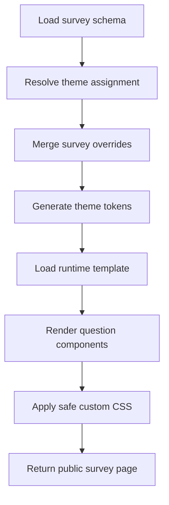

# 05 - Theme and Template Engine Architecture

## 1. Purpose

A LimeSurvey-like system needs a deeper theme engine than simple colors and logos. Survey appearance should support organization branding, survey-specific themes, layout templates, question renderer overrides, public runtime templates, email template styling, and white-label requirements.

## 2. Theme Layers

| Layer | Description |
|---|---|
| System Theme | Default platform theme. |
| Organization Theme | Company/client-level branding. |
| Survey Theme | Survey-specific visual settings. |
| Runtime Template | Layout used by respondents. |
| Question Renderer | Component style for specific question types. |
| Email Theme | Email header/footer/button design. |
| Custom CSS | Controlled CSS overrides if allowed. |

## 3. Theme Resolution Order

```txt
Survey Theme
    fallback to Organization Theme
        fallback to System Default Theme
```

## 4. Data Model Additions

```prisma
model Theme {
  id             String @id @default(uuid())
  organizationId String?
  name           String
  slug           String
  description    String?
  themeJson      Json   @default("{}")
  customCss      String?
  isSystem       Boolean @default(false)
  isActive       Boolean @default(true)
  createdAt      DateTime @default(now())
  updatedAt      DateTime @updatedAt

  @@unique([organizationId, slug])
}

model SurveyThemeAssignment {
  id        String @id @default(uuid())
  surveyId  String @unique
  themeId   String
  overridesJson Json @default("{}")
}

model ThemeAsset {
  id        String @id @default(uuid())
  themeId   String
  fileAssetId String
  assetType String // logo, background, font, icon

  @@index([themeId, assetType])
}
```

## 5. Theme JSON Example

```json
{
  "colors": {
    "primary": "#0f4a7a",
    "secondary": "#f97316",
    "background": "#ffffff",
    "surface": "#f8fafc",
    "text": "#111827",
    "mutedText": "#6b7280"
  },
  "typography": {
    "fontFamily": "Inter",
    "headingWeight": 700,
    "bodySize": "16px"
  },
  "layout": {
    "type": "centered-card",
    "maxWidth": "760px",
    "spacing": "comfortable",
    "showProgressBar": true
  },
  "buttons": {
    "radius": "8px",
    "style": "filled"
  },
  "question": {
    "labelPosition": "top",
    "helpTextPosition": "below-label",
    "errorPosition": "below-input"
  }
}
```

## 6. Runtime Rendering Pipeline



## 7. Template Types

| Template | Description |
|---|---|
| `centered-card` | Simple single-column card. |
| `full-width` | Full-screen modern layout. |
| `government-form` | Formal structured layout. |
| `wizard` | Step-by-step survey. |
| `kiosk` | Large buttons, repeated submissions. |
| `embedded` | Minimal chrome for iframe/embed. |

## 8. Question Renderer Overrides

Allow theme-level overrides for question rendering:

```json
{
  "renderers": {
    "single_choice": "cards",
    "rating": "stars",
    "matrix_single": "table-compact"
  }
}
```

## 9. Security for Custom CSS

- Only allow custom CSS for trusted admin roles.
- Scope CSS under survey container class, e.g. `.survey-runtime[data-survey-id="..."]`.
- Block external `@import` unless approved.
- Block JavaScript URLs.
- Sanitize uploaded fonts/assets.

## 10. Theme Builder UI

```txt
+----------------------------------------------------------+
| Theme Name | Preview Mode: Desktop / Tablet / Mobile      |
+---------------------+------------------------------------+
| Settings Panel      | Live Survey Preview                |
| Colors              | Question preview                   |
| Typography          | Button preview                     |
| Layout              | Matrix preview                     |
| Custom CSS          | Error/validation preview           |
+---------------------+------------------------------------+
```

## 11. Implementation Notes

- Use CSS variables generated from `themeJson`.
- Keep runtime components theme-aware but not theme-dependent.
- Theme should not change survey logic.
- Store theme version in survey snapshot if published survey must remain visually stable.
