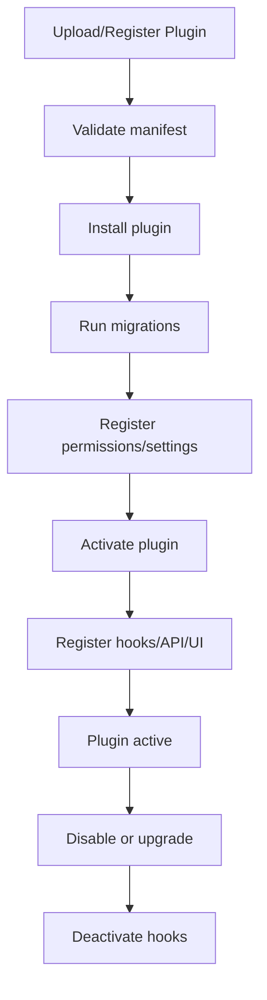

# 06 - Plugin Lifecycle and Extension Framework

## 1. Purpose

The base document includes internal events. For stronger LimeSurvey-like parity, the system needs a real plugin lifecycle: install, activate, configure, register hooks, inject navigation, expose API routes, run migrations, and safely disable/uninstall.

## 2. Plugin Lifecycle States

| State | Meaning |
|---|---|
| Discovered | Plugin files/package exists but not installed. |
| Installed | Plugin metadata and migrations are registered. |
| Active | Plugin hooks and UI are enabled. |
| Inactive | Installed but not running. |
| Upgrade Required | Plugin version changed and migration is pending. |
| Failed | Plugin activation failed. |
| Uninstalled | Plugin data removed or archived. |

## 3. Lifecycle Flow



## 4. Plugin Manifest Example

```json
{
  "id": "ai-integration",
  "name": "AI Integration",
  "version": "1.0.0",
  "description": "Generate survey content and AI reports.",
  "entry": "./server/plugin.ts",
  "author": "Internal Team",
  "permissions": [
    "plugin.ai.configure",
    "plugin.ai.generate_content",
    "plugin.ai.view_report"
  ],
  "events": [
    "survey.created",
    "survey.published",
    "response.submitted"
  ],
  "navigation": [
    {
      "area": "survey-settings",
      "label": "AI Assistant",
      "route": "/admin/surveys/:surveyId/plugins/ai"
    }
  ]
}
```

## 5. Data Model Additions

```prisma
model Plugin {
  id          String @id
  name        String
  version     String
  status      String // discovered, installed, active, inactive, failed
  manifestJson Json @default("{}")
  settingsJson Json @default("{}")
  errorJson   Json @default("{}")
  installedAt DateTime?
  activatedAt DateTime?
  updatedAt   DateTime @updatedAt
}

model PluginSetting {
  id        String @id @default(uuid())
  pluginId  String
  scope     String // system, organization, survey
  scopeId   String?
  key       String
  valueJson Json @default("{}")

  @@unique([pluginId, scope, scopeId, key])
}

model PluginMigration {
  id        String @id @default(uuid())
  pluginId  String
  version   String
  name      String
  executedAt DateTime @default(now())

  @@unique([pluginId, version, name])
}
```

## 6. Extension Points

| Hook | Example Use |
|---|---|
| `survey.created` | Generate default content. |
| `survey.beforePublish` | Validate plugin-specific schema. |
| `survey.published` | Generate cache/index. |
| `runtime.beforeRender` | Inject tracking or custom variables. |
| `runtime.afterAnswerSave` | Process answer. |
| `response.submitted` | Send webhook, AI analysis, CRM sync. |
| `report.beforeRender` | Add custom report tab. |
| `export.beforeGenerate` | Add custom export fields. |
| `admin.navigation` | Inject menu item. |
| `permissions.register` | Register plugin permissions. |

## 7. Plugin API Contract

```ts
export type SurveyPlugin = {
  manifest: PluginManifest;
  install?: (ctx: PluginContext) => Promise<void>;
  activate?: (ctx: PluginContext) => Promise<void>;
  deactivate?: (ctx: PluginContext) => Promise<void>;
  uninstall?: (ctx: PluginContext) => Promise<void>;
  registerHooks?: (registry: HookRegistry) => void;
  registerRoutes?: (router: PluginRouter) => void;
  registerNavigation?: (nav: NavigationRegistry) => void;
  registerPermissions?: (permissions: PermissionRegistry) => void;
};
```

## 8. Event Handling Strategy

For V1:

- Keep plugins internal and code-reviewed.
- Load plugin definitions from a server-side registry.
- Execute hooks in-process.
- Store `DomainEvent` records for traceability.

For V2:

- Move heavy plugin work to queue jobs.
- Support plugin package upload.
- Add plugin sandboxing or isolated worker processes.

## 9. Failure Handling

- Plugin failure must not break core survey submission.
- Use hook timeout limits.
- Log plugin errors separately.
- Disable plugin automatically if repeated critical failures occur.
- Hooks that run during response submission should be non-blocking unless explicitly configured.

## 10. Implementation Notes

- Do not allow arbitrary plugin code upload in early versions.
- Start with internal plugin registry.
- Build the event and hook interfaces now so future plugins are easier.
- Keep plugin data separated by plugin ID.
