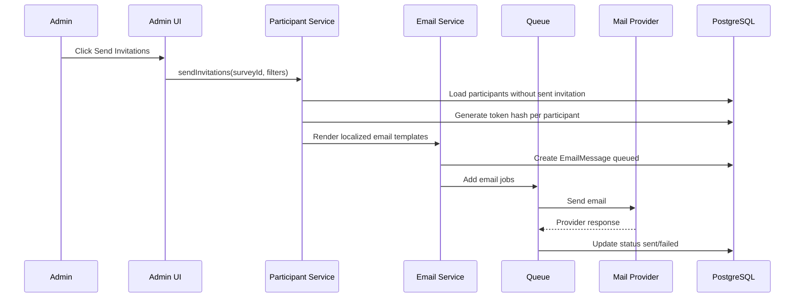

# 07 - Email Template, Invitation, Reminder, and Token Workflow

## 1. Purpose

A complete survey platform must support participant lists, secure tokens, email invitations, reminders, confirmation emails, bounce tracking, localized templates, retry queues, and delivery status.

## 2. Email Types

| Email Type | Recipient | Trigger |
|---|---|---|
| Invitation | Participant | Admin sends survey invite. |
| Reminder | Participant | Admin/manual/scheduled reminder. |
| Confirmation | Participant/respondent | Response submitted. |
| Admin Notification | Admin/manager | New response submitted. |
| Export Ready | Admin/analyst | Export job completed. |
| Token Expiry Warning | Participant | Token will expire soon. |
| Bounce Alert | Admin | Delivery failed repeatedly. |

## 3. Token Model

Tokens should be generated with cryptographically secure random values. Store only token hash in the database.

Token URL example:

```txt
https://survey.example.com/t/tkn_9WcKx8...
```

The raw token is only shown once in email or redirect URL.

## 4. Data Model Additions

```prisma
model EmailTemplate {
  id             String @id @default(uuid())
  organizationId String?
  surveyId       String?
  key            String // invitation, reminder, confirmation
  name           String
  defaultLanguage String
  variablesJson  Json @default("[]")
  isActive       Boolean @default(true)
  createdAt      DateTime @default(now())
  updatedAt      DateTime @updatedAt

  @@index([organizationId, surveyId, key])
}

model EmailMessage {
  id           String @id @default(uuid())
  surveyId     String?
  participantId String?
  invitationId String?
  templateKey  String
  toEmail      String
  subject      String
  bodyHtml     String
  status       String // queued, sending, sent, failed, bounced, opened, clicked
  provider     String?
  providerMessageId String?
  errorMessage String?
  queuedAt     DateTime @default(now())
  sentAt       DateTime?
  openedAt     DateTime?
  clickedAt    DateTime?

  @@index([surveyId, status])
  @@index([participantId])
}

model InvitationAttempt {
  id           String @id @default(uuid())
  invitationId String
  emailMessageId String?
  attemptType  String // invitation, reminder
  status       String
  sentAt       DateTime?
  errorJson    Json @default("{}")

  @@index([invitationId, attemptType])
}
```

## 5. Invitation Send Flow



## 6. Reminder Rules

Reminder should only send when:

- Invitation was sent.
- Participant has not completed response.
- Token is not expired.
- Participant has not unsubscribed.
- Reminder limit has not been reached.
- Minimum delay from previous email has passed.

## 7. Email Template Variables

| Variable | Description |
|---|---|
| `{{participant.name}}` | Participant name. |
| `{{participant.email}}` | Participant email. |
| `{{survey.title}}` | Survey title. |
| `{{survey.description}}` | Survey description. |
| `{{survey.link}}` | Token or public survey link. |
| `{{token.expiresAt}}` | Token expiry date. |
| `{{organization.name}}` | Organization name. |
| `{{unsubscribe.link}}` | Opt-out link. |

## 8. Email Status Flow

```txt
queued -> sending -> sent -> opened -> clicked -> started -> completed
                    \-> failed -> retrying -> failed_permanent
                    \-> bounced
                    \-> unsubscribed
```

## 9. API Endpoints

```txt
GET  /api/admin/surveys/[surveyId]/email-templates
PUT  /api/admin/surveys/[surveyId]/email-templates/[templateKey]
POST /api/admin/surveys/[surveyId]/invitations/send
POST /api/admin/surveys/[surveyId]/invitations/remind
GET  /api/admin/surveys/[surveyId]/email-log
POST /api/webhooks/email-provider
```

## 10. Security and Privacy

- Hash tokens in database.
- Rate-limit token validation endpoint.
- Do not leak whether an email exists publicly.
- Support token expiry and revocation.
- Add unsubscribe support if emailing external participants.
- Do not include sensitive answer data in normal email content.

## 11. Implementation Notes

- Queue email sending with BullMQ/Redis.
- Store rendered email content for audit/debugging.
- Keep template localization aligned with survey language settings.
- Add provider abstraction so SMTP, SendGrid, SES, Mailgun, or Postmark can be swapped.
