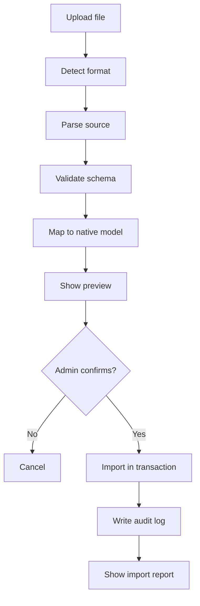
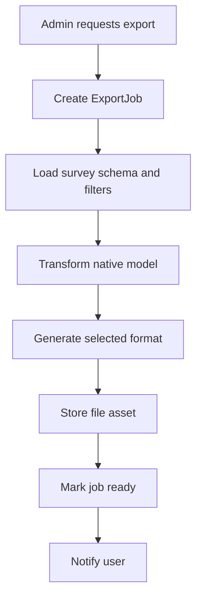

# 08 - Import and Export Compatibility Architecture

## 1. Purpose

A LimeSurvey-like replacement should support import/export workflows for survey structure, questions, responses, participants, templates, and backups. Compatibility with LimeSurvey formats helps migration from existing installations.

## 2. Supported Formats

| Format | Direction | Purpose |
|---|---|---|
| `.lss` | Import/Export | LimeSurvey survey structure. |
| `.lsa` | Import | LimeSurvey survey archive, may include responses/tokens depending source. |
| `.lsq` | Import/Export | LimeSurvey question export/import. |
| CSV | Import/Export | Participants and responses. |
| XLSX | Export | Response table/reporting. |
| JSON | Import/Export | Native platform structure. |
| PDF | Export | Survey printable form or report. |

## 3. Import Pipeline



## 4. Export Pipeline



## 5. Data Model Additions

```prisma
model ImportJob {
  id             String @id @default(uuid())
  organizationId String
  requestedById  String
  type           String // lss, lsa, lsq, csv, json
  status         String // uploaded, parsed, validated, previewed, imported, failed
  sourceFileId   String
  resultJson     Json @default("{}")
  errorJson      Json @default("{}")
  createdAt      DateTime @default(now())
  completedAt    DateTime?

  @@index([organizationId, status])
}

model ImportMapping {
  id        String @id @default(uuid())
  importJobId String
  sourcePath String
  targetType String
  targetId   String?
  mappingJson Json @default("{}")

  @@index([importJobId, targetType])
}
```

## 6. `.lss` Survey Structure Mapping

| LimeSurvey Concept | Native Concept |
|---|---|
| Survey metadata | `Survey` + `SurveyTranslation`. |
| Question groups | `SurveyPage`. |
| Questions | `Question`. |
| Answers | `QuestionOption`. |
| Subquestions | `QuestionSubquestion`. |
| Conditions/Relevance | `ExpressionRule` / `logicRules`. |
| Quotas | `Quota`. |
| Assessments | Assessment/score module. |
| Languages | `SurveyLanguage` + translation tables. |
| Theme/template | `Theme` assignment if compatible. |

## 7. `.lsq` Question Mapping

`.lsq` should import a reusable question definition. The import wizard should allow:

- Import as new question inside selected page.
- Save as reusable question template.
- Map missing answer options/subquestions.
- Convert unsupported question settings to `metadataJson`.

## 8. `.lsa` Archive Mapping

`.lsa` is more complex because archives may contain structure and data. Import should support phases:

1. Import survey structure only.
2. Import participants/tokens if available.
3. Import responses if compatible.
4. Preserve old response IDs in metadata.
5. Generate an import report listing unsupported features.

## 9. Native JSON Export

Native JSON is the preferred backup/transfer format.

```json
{
  "format": "survey-platform-json",
  "version": "1.0",
  "exportedAt": "2026-07-09T00:00:00Z",
  "survey": {},
  "languages": [],
  "pages": [],
  "questions": [],
  "options": [],
  "subquestions": [],
  "logicRules": [],
  "quotas": [],
  "theme": {}
}
```

## 10. Response Export Compatibility

Flat response export should support LimeSurvey-style column names when requested.

| Native | LimeSurvey-like Export |
|---|---|
| `responseSession.id` | `id` |
| `submittedAt` | `submitdate` |
| `startedAt` | `startdate` |
| `participant.token` | `token` |
| `Q1` | `Q1` |
| `Q1` subquestion `SQ001` | `Q1_SQ001` |
| Multiple choice option `A1` | `Q1_A1` |

## 11. Import Error Handling

Every import should return:

- Total items parsed.
- Total items imported.
- Warnings.
- Unsupported features.
- Mapping summary.
- Rollback status.

## 12. Implementation Notes

- Use queue jobs for large imports/exports.
- Use transactions for structure import where possible.
- Store original uploaded file for audit/debugging.
- Do not promise perfect `.lss/.lsa` compatibility in V1; implement compatibility progressively.
