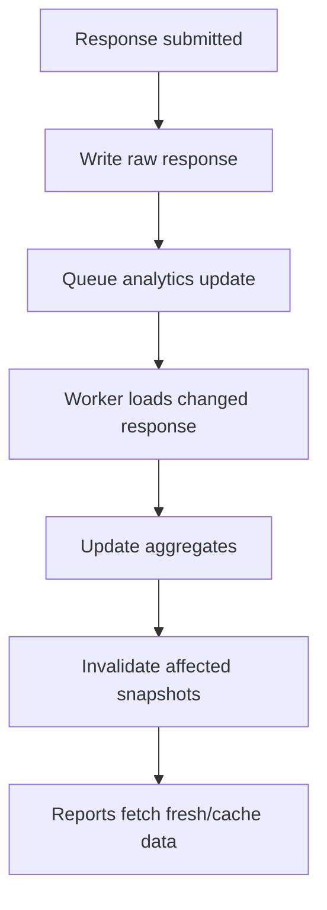

# 09 - Statistics and Analytics Engine Architecture

## 1. Purpose

The statistics engine provides aggregated insights from survey responses: overview metrics, question summaries, cross-tabs, filters, trends, charts, exports, and optional AI analytics.

This module should be separate from raw response storage. Response submission must remain fast; heavy aggregation can run in background jobs.

## 2. Statistics Layers

| Layer | Purpose |
|---|---|
| Raw Responses | `ResponseSession` and `Answer`. |
| Display Values | Precomputed readable values for reports. |
| Aggregates | Counts, averages, distributions. |
| Materialized Views | Cached tables for large surveys. |
| Chart Data | API-ready structures for frontend charts. |
| Export Data | Flat rows or summary sheets. |
| AI Analytics | Sentiment, themes, summaries, insights. |

## 3. Report Types

| Report | Description |
|---|---|
| Overview | Response count, completion, duration, status distribution. |
| Question Summary | Per-question distribution or statistics. |
| Response Table | One row per respondent. |
| Individual Response | Full answer detail. |
| Cross-tab | Compare two or more questions. |
| Trend | Responses over time. |
| Funnel | Drop-off by page/question. |
| Quality | Short text rate, duplicate rate, empty answer rate. |
| AI Report | Sentiment, themes, insights. |

## 4. Data Model Additions

```prisma
model AnalyticsSnapshot {
  id             String @id @default(uuid())
  surveyId       String
  surveyVersionId String?
  snapshotType   String // overview, question, crosstab, trend
  filtersHash    String
  dataJson       Json @default("{}")
  generatedAt    DateTime @default(now())
  expiresAt      DateTime?

  @@unique([surveyId, snapshotType, filtersHash])
  @@index([surveyId, generatedAt])
}

model ResponseAggregate {
  id        String @id @default(uuid())
  surveyId  String
  questionId String?
  metricKey String
  dimensionJson Json @default("{}")
  valueJson Json @default("{}")
  calculatedAt DateTime @default(now())

  @@index([surveyId, questionId, metricKey])
}
```

## 5. Aggregation Flow



## 6. Question Summary Rules

| Question Type | Metrics |
|---|---|
| Single choice | Count and percentage per option. |
| Multiple choice | Count and percentage per option independently. |
| Number | Count, avg, min, max, median, distribution. |
| Rating/NPS | Average, distribution, promoter/passive/detractor. |
| Matrix | Per-row and per-column counts. |
| Ranking | Average rank, first-choice count. |
| Text | Response list, word frequency, sentiment optional. |
| File upload | File count, total size, extension distribution. |
| Date | Date histogram, min/max. |

## 7. Filter Model

```json
{
  "status": ["SUBMITTED"],
  "dateRange": {
    "from": "2026-07-01",
    "to": "2026-07-31"
  },
  "answers": [
    {
      "questionId": "q_country",
      "operator": "equals",
      "value": "MY"
    }
  ],
  "participantAttributes": [
    {
      "key": "department",
      "operator": "equals",
      "value": "Support"
    }
  ]
}
```

## 8. Cross-tab Example

```json
{
  "rows": {
    "questionId": "q_gender"
  },
  "columns": {
    "questionId": "q_satisfaction"
  },
  "metric": "count",
  "filters": {}
}
```

Output:

```json
{
  "rowLabels": ["Male", "Female"],
  "columnLabels": ["Satisfied", "Neutral", "Dissatisfied"],
  "cells": [
    [40, 10, 5],
    [35, 12, 8]
  ]
}
```

## 9. Statistics API Endpoints

```txt
GET  /api/admin/surveys/[surveyId]/stats/overview
POST /api/admin/surveys/[surveyId]/stats/questions/[questionId]
POST /api/admin/surveys/[surveyId]/stats/crosstab
POST /api/admin/surveys/[surveyId]/stats/trend
POST /api/admin/surveys/[surveyId]/stats/export
GET  /api/admin/surveys/[surveyId]/stats/snapshots
```

## 10. Performance Strategy

| Survey Size | Strategy |
|---|---|
| Small | Query raw tables directly. |
| Medium | Cache computed summaries. |
| Large | Materialized aggregate tables. |
| Very large | Dedicated analytics warehouse/service. |

## 11. AI Analytics Integration

Optional AI analytics should be a separate layer:

- Extract text answers.
- Clean and normalize response text.
- Run sentiment/theme classification.
- Store AI analysis per answer and per survey snapshot.
- Never block normal reporting if AI fails.

Suggested model:

```prisma
model AnswerAnalysis {
  id        String @id @default(uuid())
  answerId  String
  sentimentLabel String?
  sentimentScore Float?
  themeLabel String?
  summaryShort String?
  modelName String?
  createdAt DateTime @default(now())

  @@index([answerId])
  @@index([sentimentLabel])
  @@index([themeLabel])
}
```

## 12. Implementation Notes

- Keep raw response data immutable unless admin explicitly edits/deletes.
- Avoid running heavy aggregation inside submit request.
- Use filters hash to cache repeated report queries.
- For exports, reuse the same transformation layer as reporting to avoid inconsistent numbers.
