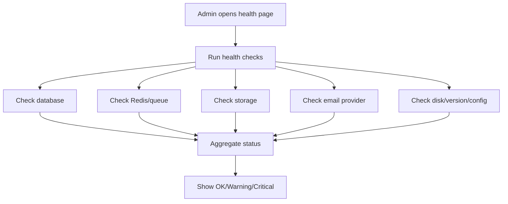

# 10 - Admin System Configuration Architecture

## 1. Purpose

A LimeSurvey-like platform needs system-level administration beyond survey management. Super admins must manage SMTP, storage, queue workers, cache, languages, security, themes, plugins, system health, API keys, feature flags, and maintenance mode.

## 2. Admin Areas

| Area | Description |
|---|---|
| Global Settings | Platform name, URL, timezone, defaults. |
| Authentication | Login methods, password policy, OAuth/SAML/SSO. |
| Email/SMTP | Provider configuration, sender identity, test email. |
| Storage | Local/S3-compatible storage settings. |
| Queue Jobs | Redis/BullMQ status, failed jobs, retry. |
| Cache | Clear cache, cache status. |
| Localization | System languages and default locale. |
| Themes | Global and organization themes. |
| Plugins | Install, activate, configure plugins. |
| Security | Rate limits, CAPTCHA, session lifetime, IP policy. |
| Audit Logs | System/admin activity. |
| System Health | Version, DB status, queue status, storage status. |
| Maintenance | Maintenance mode and admin-only access. |
| Feature Flags | Enable/disable modules progressively. |

## 3. Data Model Additions

```prisma
model SystemSetting {
  id          String @id @default(uuid())
  key         String @unique
  valueJson   Json @default("{}")
  category    String
  isSecret    Boolean @default(false)
  updatedById String?
  updatedAt   DateTime @updatedAt
}

model FeatureFlag {
  id          String @id @default(uuid())
  key         String @unique
  description String?
  enabled     Boolean @default(false)
  scope       String // system, organization
  scopeId     String?
  rulesJson   Json @default("{}")
  updatedAt   DateTime @updatedAt
}

model SystemHealthCheck {
  id        String @id @default(uuid())
  checkKey  String
  status    String // ok, warning, critical
  message   String?
  dataJson  Json @default("{}")
  checkedAt DateTime @default(now())

  @@index([checkKey, checkedAt])
}
```

## 4. Settings Categories

| Category | Example Keys |
|---|---|
| `general` | `app.name`, `app.baseUrl`, `app.timezone`. |
| `auth` | `auth.allowCredentials`, `auth.sessionLifetime`. |
| `email` | `email.provider`, `email.fromAddress`. |
| `storage` | `storage.provider`, `storage.bucket`. |
| `queue` | `queue.enabled`, `queue.concurrency`. |
| `security` | `security.rateLimit`, `security.captchaProvider`. |
| `privacy` | `privacy.ipHashing`, `privacy.retentionDays`. |
| `runtime` | `runtime.allowPublicSurveys`, `runtime.savePartialDefault`. |
| `reports` | `reports.maxExportRows`, `reports.cacheTtl`. |
| `plugins` | `plugins.allowInternalRegistry`. |

## 5. Admin Routes

```txt
/admin/system
/admin/system/settings
/admin/system/auth
/admin/system/email
/admin/system/storage
/admin/system/queue
/admin/system/cache
/admin/system/languages
/admin/system/themes
/admin/system/plugins
/admin/system/security
/admin/system/audit
/admin/system/health
/admin/system/feature-flags
```

## 6. System Health Flow



## 7. Health Checks

| Check | Status Rule |
|---|---|
| Database | Can connect and run simple query. |
| Redis | Can connect and read queue metrics. |
| Storage | Can write/read/delete test object. |
| Email | Can verify provider config or send test. |
| Cron/Queue | Recent job processed within expected time. |
| Disk | Free space above threshold. |
| App Version | Current version and migration state. |
| Security | HTTPS, cookie settings, secret length. |

## 8. Secret Handling

- Do not store sensitive values in plain JSON if avoidable.
- Prefer environment variables for secrets.
- If DB storage is needed, encrypt values at rest.
- Hide secret values in admin UI.
- Audit every secret change.

## 9. Maintenance Mode

Maintenance mode should:

- Block public survey access with friendly message.
- Allow super admins to log in.
- Pause scheduled email sends if configured.
- Continue critical queue jobs only if safe.
- Show clear banner in admin UI.

## 10. Implementation Notes

- Keep settings access through a `ConfigService`.
- Cache settings but invalidate after update.
- Avoid reading system settings directly from DB in every request.
- Define defaults in code, override from DB/env.
- Audit all system setting updates.
